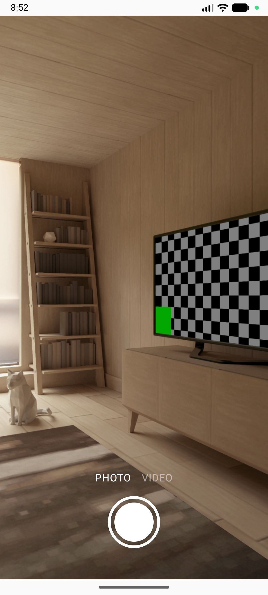
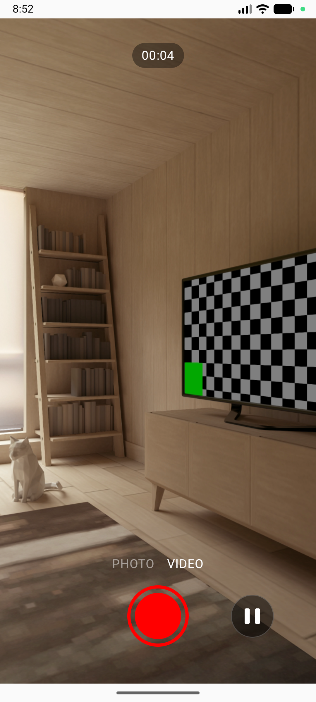

# CameraCompose 📸

A modern Android camera application built entirely with **Jetpack Compose** and **CameraX**.
This project demonstrates how to build a professional-grade camera experience using modern Android development practices, including **MVVM**, **Hilt**, and **Coroutines**.

## 📱 Screenshots

<p align="center">
  
  &nbsp;&nbsp;&nbsp;&nbsp;
  
</p>

## ✨ Features

- **Photo Capture**: High-quality image capture with instant feedback.
- **Video Recording**: Record videos with **Pause/Resume** functionality.
- **Camera Modes**: Seamless switching between Photo and Video modes.
- **Modern UI**: Custom-built, animated capture buttons and controls using Canvas and Compose animations.
- **Permissions Handling**: Robust permission management for Camera and Audio using Accompanist.
- **Edge-to-Edge**: Fully immersive full-screen experience.

## 🛠 Tech Stack

- **Language**: [Kotlin](https://kotlinlang.org/)
- **UI**: [Jetpack Compose](https://developer.android.com/jetpack/compose) (Material3)
- **Camera**: [CameraX](https://developer.android.com/training/camerax) (Core, Video, Viewfinder)
- **Architecture**: MVVM (Model-View-ViewModel)
- **Dependency Injection**: [Hilt](https://dagger.dev/hilt/)
- **Asynchronicity**: [Coroutines](https://kotlinlang.org/docs/coroutines-overview.html) & [Flow](https://kotlinlang.org/docs/flow.html)
- **Permissions**: [Accompanist Permissions](https://google.github.io/accompanist/permissions/)
- **Build System**: Gradle (Kotlin DSL)

## 🏗 Architecture

The app follows the recommended **Guide to App Architecture**:

- **UI Layer**: Composable functions (`MainScreen`) observe `StateFlow` from the ViewModel.
- **ViewModel Layer**: `MainViewModel` handles business logic, state management, and bridges the UI with the repository. It uses `StateFlow` to expose UI state (`VideoRecordState`, `CameraMode`).
- **Data Layer**: `CameraManager` (implementing `CameraRepository`) directly interacts with CameraX APIs. It manages `ProcessCameraProvider`, `ImageCapture`, and `VideoCapture` use cases.

## 🚀 Getting Started

1.  Clone the repository:
    ```bash
    git clone https://github.com/your-username/CameraCompose.git
    ```
2.  Open the project in **Android Studio**.
3.  Sync Gradle dependencies.
4.  Run the app on an emulator or physical device (Android 10+, API 29+ recommended).
    *Note: A physical device is recommended for testing Camera features.*
